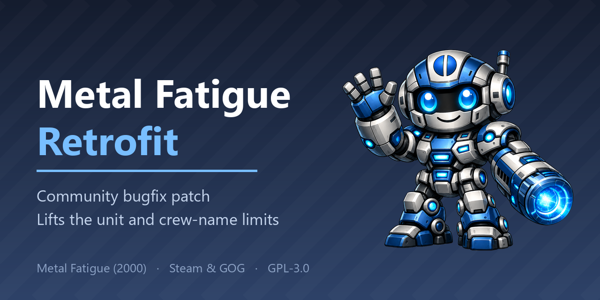



# Metal Fatigue Retrofit

A distributable patcher that fixes two long-standing bugs in **Metal Fatigue** (Zono/Psygnosis, 2000; rights now at Nightdive/Atari):

1. **Global memory-based unit limit** — the game caps in-use game-object allocations at a hard-coded **8 MB** inside a fixed **10 MB** pool, blocking unit production long before any real memory pressure. Independent of how much RAM you have. This was a huge problem in Matches with 6+ players seeing as unit production got blocked quite early due to the unit limit being global.
2. **Crew-name limit (~50 per faction)** — combots draw pilot/crew names from a fixed 50-name pool per faction. The names come back when a crew dies, so this is a cap on how many combots you can field **at once**; reach it and production is refused with a leftover developer line ("Couldn't find a name for this crew!").

## Download

Two equivalent downloads — both do the exact same thing:

- **Standalone (recommended)** — `MetalFatigueRetrofitPatcher.exe`. Just run it. Nothing is installed,
  nothing is left behind. Undo any time with the built-in **Restore original** button.
  (The `.zip` on the release page holds that same exe together with the README and the licence.)
- **Installer (optional)** — `…-Setup.exe`. A classic wizard that adds a Start-Menu entry and an
  Add/Remove-Programs uninstaller (which can also restore the original). Handy if you prefer that,
  but it patches your game exactly the same way.

Both are unsigned, so Windows shows the same *"unknown publisher"* prompt either way — see
[Is this safe?](#is-this-safe) for how to verify. The patcher never installs itself into the game
or runs in the background; it edits one file and exits.

## How it works

The patcher operates on **your own legally-owned copy** of `MFatigue.exe`. It never distributes game code — it makes a backup, then patches your binary in place. This is how community patches have worked for decades.

- Works with **both GOG and Steam** — they ship the identical executable (see below).
- The game EXE exports 985 mangled C++ symbols, so functions were located by name — no guesswork.

> ⚠️ The EXE must stay named `MFatigue.exe` — the game refuses to launch under any other name. The patcher therefore patches in place (with a `.bak` backup), never emitting a renamed file.

## Versions

Since 1.4.0 the unit budget is a **slider** with nine steps rather than four fixed versions:

| Step | Unit budget |
|------|-------------|
| **1.5×** | 12 MB soft cap (arena 15 MB) |
| **2×** | 16 MB soft cap (arena 20 MB) |
| **2.5×** | 20 MB soft cap (arena 25 MB) |
| **3×** | 24 MB soft cap (arena 30 MB) |
| **3.5×** | 28 MB soft cap (arena 35 MB) |
| **4×** ★ | 32 MB soft cap (arena 40 MB) |
| **6×** | 48 MB soft cap (arena 60 MB) |
| **8×** | 64 MB soft cap (arena 80 MB) |
| **Maximum** | 120 MB soft cap (arena 128 MB) |

★ recommended for 6+ players. Vanilla is 8 MB inside a 10 MB arena, so every step keeps that
80 % ratio; only *Maximum* pushes it higher.

**The crew-name limit is a separate switch.** Up to 1.3.x it was welded to *Maximum*, where
choosing the biggest unit budget silently also changed how crews are named. The two limits come
from unrelated places in the executable, and the interface now says so: tick **Lift the ~50
crew-name limit** to let each tier reuse its own names, which is what allows more than 50 crews
alive at once — at the price of names repeating. *Patched with Maximum before 1.4.0? Tick that
box to keep what you had.*

The memory soft cap is kept as a safety valve (blocks gracefully near real exhaustion instead
of crashing) — just moved far above the artificial 8 MB wall.

**Optional add-on:** *share vision with allies* — allied units also lift your fog of war.
Combinable with any step of the slider.

## Cheats (optional)

A separate **Cheats** tab, layered on top of whatever you set above — nothing here is needed
for the bug fixes, it's just for fun and experimenting. Everything is individually toggleable:

- **No fog of war**, **Free building**, **Instant build**, **Unlimited high-tier crews** (includes the crew-name limit, so the switch above is not needed alongside it).
- A **Me only / All players (incl. AI)** switch for Free building and Instant build — hand the
  AI the same advantages, or keep them for yourself.
- **Unlock combot parts of other factions** — a checkable tree of every faction's arms, legs and
  torsos, plus the three faction-specific **superweapons**. Build a Rimtech mech with a Neuropa
  plasma cannon and MilAgro legs. The AI actually uses unlocked parts too (its own build logic
  already salvages and researches enemy parts), so there's a scope switch here as well.

Loading an already-patched EXE restores every one of these settings in the interface, so
re-patching never silently drops what you had.

Good to know (all working as intended, not bugs):

- Only *cross-faction* parts are unlocked. Your own faction's parts that require a specific
  building (e.g. a research center or AI facility) still need that building.
- Alien parts built during the **prebuild phase** must be re-researched at a research center
  afterwards.
- Unit and crew limits always apply to every player; part unlocks always apply to you (unless you
  flip the switch to all players).

## Music: Rimtech's missing soundtrack (optional)

*Metal Fatigue* shipped on two CDs. **CD 1 held Rimtech's music, CD 2 held Mil-Agro's and
Neuropa's.** The game never told them apart in code — it asked the CD drive for a track *number*,
and whichever disc sat in the tray decided whose music that was. The re-release ships only CD 2's
audio, so Rimtech asks for the same numbers as Mil-Agro and gets Mil-Agro's music.

The **Music** tab fixes that by giving Rimtech ten track numbers of its own and copying your files
into them. **No game audio is included** — the patcher ships none and links to no source. Supply
the ten Rimtech tracks yourself, from your own CD 1 or wherever you can obtain them, as **OGG
Vorbis** files (the game's audio layer reads nothing else).

- Import from a **folder or a zip**; the tracks are matched to their slots by playing time, not by
  file name, since every source names them differently.
- The list shows what is on disk right now, colour-coded: in use by the game, copied but not
  patched yet, or a length that does not fit its slot.
- Any track can be **played back** in the patcher, with a seek bar — handy when a source arrived in
  a different order and you need to sort it out. Rows can be moved with the arrow buttons.
- **Remove imported music** takes out only the ten files it added and restores the original track
  numbers. The game's own 22 tracks are never touched.
- **Restore original** does not delete your tracks. It puts the executable back, so the game plays
  its own music again, but the ten files stay where they are and the Music tab tells you they are
  ready — one Patch brings them back without importing them again. Use **Remove imported music**
  when you want the files gone as well.

The track order *should* match the CD, but only the exe's 16-byte table decides which numbers
Rimtech asks for — so nothing breaks if a track sits one slot off; the wrong piece simply plays.

The workaround that circulates on the GOG and Steam forums is to overwrite tracks 03–12 — Mil-Agro's
music — with Rimtech's, and then keep two `MUSIC` folders and swap them between sessions, because
both factions ask the game for the same ten numbers. Renaming files cannot fix that; the numbers
live in the executable. This patch changes the numbers instead, so all three factions keep their own
music at the same time and none of the game's own audio is overwritten.

## Is this safe?

Windows shows an **"unknown publisher"** warning. That is expected: the patcher is not
code-signed, because a code-signing certificate costs several hundred euros a year — hard to
justify for a free community patch. So instead of asking for trust, here is how to verify it:

1. **Read the source.** The whole patcher is in this repository under the GPL. The patch bytes
   and every offset live in [`patcher/PatchData.cs`](patcher/PatchData.cs) — nothing is hidden
   or obfuscated, deliberately.
2. **Check the checksum.** Every release ships `SHA256SUMS.txt`. Verify with
   `Get-FileHash MetalFatigueRetrofitPatcher.exe -Algorithm SHA256` and compare.
3. **Scan it.** Upload the exe to [VirusTotal](https://www.virustotal.com/) — unsigned tools
   that write to other programs' files sometimes trigger heuristic flags.
4. **Build it yourself.** `dotnet build -c Release` builds the patcher from this source.
   Note that .NET stamps every build with its own build ID and source paths, so your binary
   will **not** be byte-identical to the released one — compare the source and the behaviour,
   not the hashes. The published checksums verify the *download*, not the build.

**What the patcher actually does:**

- Reads the registry to find your Steam/GOG install — **read-only**
- Reads and writes exactly **one** file: your `MFatigue.exe`, after creating `MFatigue.exe.bak`
- Writes one small text file (`%ProgramData%\MetalFatiguePatcher\lastgame.txt`) so the
  uninstaller can offer to restore the original
- Asks for administrator rights only because games often live under `Program Files`
- **Makes no network connections**, has no telemetry, installs no service and no auto-start.
  (The licence link simply opens your browser.)

It also refuses to touch anything it does not recognise: it verifies the file against the known
build before patching, always patches from the verified backup, checks every byte it is about to
overwrite, and re-reads the result afterwards to confirm.

## Layout

- `patcher/` — the GUI patcher (detect · choose settings · backup · patch · verify · restore)
- `installer/` — Inno Setup script for the optional `Setup.exe`
- `scripts/` — build and release helpers

## Steam & GOG

The **GOG and Steam `MFatigue.exe` are byte-identical** (SHA256 `26d428f1…`, the Nightdive 2021 re-release, no SteamStub). The same patch offsets apply to both, and the patcher auto-detects either store.

> Steam note: **"Verify integrity of game files"** will detect the patched EXE and re-download the original. That's expected — just re-run the patcher afterwards (your `.bak` also lets you restore). Steam does not re-verify on normal launch, so the patch persists.

## Reporting a bug or an unsupported version

**[Open an issue →](https://github.com/realDantalion/metal-fatigue-retrofit/issues/new/choose)**

- **Something is broken** — use *Bug report*, and paste the contents of the patcher's log box. That alone usually shows the cause.
- **The patcher hit an unexpected error** — it writes a file named `MetalFatigueRetrofitPatcher-ErrorLog-<date>.txt` next to its own exe and offers to open that folder. **Attach it.** It carries the version, your Windows build, what the patcher was working on and the full stack trace — everything the log box can't tell me. Your Windows user name is stripped out automatically.
- **The patcher doesn't recognise your build** — use *Unsupported game version* and include the file size and SHA-256 of your `MFatigue.exe`. Only the Nightdive re-release is supported so far.

### Worth reporting

- **The patcher stops recognising a Steam or GOG copy.** Usually means the game got an update and the executable changed — that affects everyone, so it's the most useful thing you can report.
- **The game won't start, or crashes after patching**, and doesn't on the unpatched original.
- **"Restore original" doesn't bring the game back.** Anything touching the backup matters most of all.
- **A limit hits far earlier than the slider promises** — production stalling like vanilla although you set *8×*, for example.
- **Combot production stops although *Lift the ~50 crew-name limit* is ticked**, where names are supposed to be reused indefinitely.
- **Multiplayer desyncs although every player ran the identical build.** This is the least-tested area of the patch.
- **"Share vision with allies" is enabled but nothing changes** in a match with an ally.
- **Wrong, garbled or missing text** in any of the 10 languages, or text clipped inside the window.
- **The patcher itself crashes**, hangs, or shows an error you can't get past.

### Things that are not bugs

All of these are expected — please check the list before opening an issue:

- **Windows warns about an "unknown publisher", or antivirus flags the patcher.** It isn't code-signed, and it writes into another program's file, which trips heuristics. [How to verify it instead](#is-this-safe).
- **Steam's "Verify integrity of game files" undoes the patch.** Steam sees a modified EXE and re-downloads the original. Just run the patcher again.
- **You still can't build more than ~50 combots at a time.** The unit slider does not touch that cap **on purpose** — it comes from the crew-name list, which is its own switch. Tick *Lift the ~50 crew-name limit* if you want past it. Note the cap is on combots *alive*: losing one frees its name immediately.
- **Unit production still stops eventually.** The memory cap isn't removed, only moved far above the artificial 8 MB wall. It stays as a safety valve, so the game blocks gracefully instead of crashing.
- **The framerate drops in huge battles.** That's the engine, not the patch. A 2000-era RTS was never built for these unit counts and can't spread the work across modern multi-core CPUs, so faster hardware helps far less than you would expect. The patch lifted an artificial cap — it can't make an old engine scale.
- **The patcher refuses your `MFatigue.exe`.** Deliberate — it only touches builds it can positively identify. Report that as an *unsupported version* instead.
- **You picked your country's flag in the patcher, but it still refuses your game.** The flags only switch the **patcher's own interface language**. They have nothing to do with which build of the game is supported, and selecting one does not make the patcher work with a differently localised copy.
- **You installed a fan translation and the patcher no longer recognises the game.** The patcher only ever looks at `MFatigue.exe`. A translation that replaces just data files is completely fine; one that replaces the executable makes it a build the patcher doesn't know, so it refuses on purpose. In that case: restore the original EXE first (on Steam: *Verify integrity of game files*), patch that, then re-apply the translation — and note that if the translation replaces `MFatigue.exe` itself, it will overwrite the patch, so you can only have one or the other.
  - The widely used **German language patch is unaffected** — it was checked, and it only replaces files under `TBD\` (mission data, text, cinematics). It never touches `MFatigue.exe`, so it works alongside this patcher in either order.
- **Multiplayer desyncs.** Every player must run the **exact same** patch version. Differently patched EXEs will desync.
- **Your allies don't see what you see.** *Share vision with allies* only changes **your** view; each player has to enable it for themselves.
- **The AI is brutally strong.** If you set a cheat's scope to *All players (incl. AI)*, or unlocked parts for all players, the AI gets those advantages too. That's what the switch does.
- **The game won't start after you renamed the EXE.** Metal Fatigue refuses to launch under any name other than `MFatigue.exe`. That's the game, not the patch.

## License

Copyright (C) 2026 **Dantalion** (github.com/realDantalion)

This program is free software: you can redistribute it and/or modify it under the terms of the **GNU General Public License v3** (or, at your option, any later version) — see [`LICENSE`](LICENSE).

It is distributed in the hope that it will be useful, but **WITHOUT ANY WARRANTY**; without even the implied warranty of MERCHANTABILITY or FITNESS FOR A PARTICULAR PURPOSE.

> **If you build on this work:** the GPL requires you to keep the copyright notices intact, state that you changed it, publish your source under the same licence, and — because the patcher displays *Appropriate Legal Notices* in its UI (GPL §5d) — keep those notices visible in your version too.

## Credits

- Patcher, reverse engineering and documentation: **Dantalion**
- *Metal Fatigue* was developed by **Zono** (2000) and re-released on Steam and GOG by **Nightdive Studios**. This project is not affiliated with them.

## Legal

Game rights holder: Nightdive Studios / Atari. This project distributes **only the patcher**, never game code or assets — it modifies the copy you already own.

Two things worth stating explicitly, because both look like asset distribution at a glance and are not:

- **Build icons are decoded at runtime from your own installation.** The parts screen shows the game's own icons so you can recognise what you are unlocking. Nothing is extracted, converted or bundled — the patcher reads the files already on your disk while it runs, and keeps no copy.
- **No music is shipped.** Rimtech's soundtrack was on CD 1 and is missing from the re-release. The patcher can point the game at additional track slots and copy files *you* provide into place, but it contains no game audio of any kind and links to no source for it.

## Status

Reverse engineering complete and all patches validated in-game: no crash at ~60–70 combots plus
heavy vehicle and AI battles (framerate is the natural limit now), and shared vision confirmed
working with an allied player. The GUI patcher is feature-complete in 10 languages.

Not yet verified: behaviour in a real **multiplayer** match. Shared vision should be safe there
— it only affects local rendering — but it has not been tested, and as always every player must
run the identical build.

## Thanks
A big thank you to killzone_sx on the GOG forum:
https://www.gog.com/forum/metal_fatigue/unit_limit

A year ago he had already tracked the problem down to a function called
MFatigue.CBasicUnit::IsGameMemoryLow, and found that forcing it to always return false
removes the limit - but makes the game crash after a while. He also suspected the real
cause: that the game allocates a block of memory once at startup and can never grow it.
That turned out to be exactly right, and it's what this patch is built on. The game
reserves a fixed pool and refuses to produce anything once a hard-coded fraction of it
is in use. Simply switching the check off lets the game keep filling a pool that was
never made bigger - which is why it crashes. So instead of disabling it, the patch
enlarges the pool and moves the threshold up along with it. The limit stays in place as
a safety net, just far above where it used to sit.

